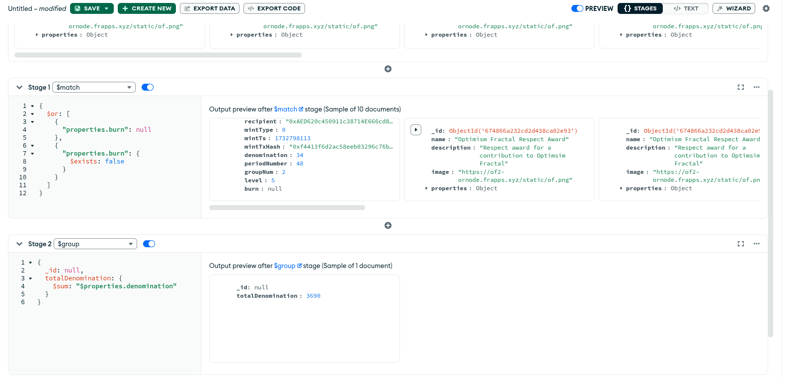

# Total Respect Missmatch

I'm getting this error in https://of.frapps.xyz:

I've ran aggregate query to calculate total respect from respect awards saved in ornode db:

.

I suspect the problem is probably that some respect mint events were missed by ornode.

## Solution

Createa a script that would check for consistency between blockchain events and respect awards stored in ornode db. It should output any discrepancies found.

